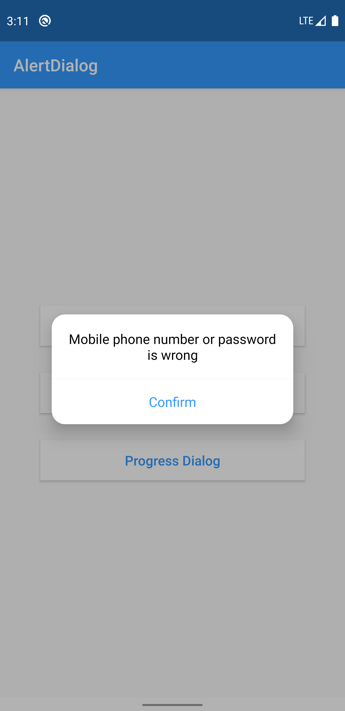
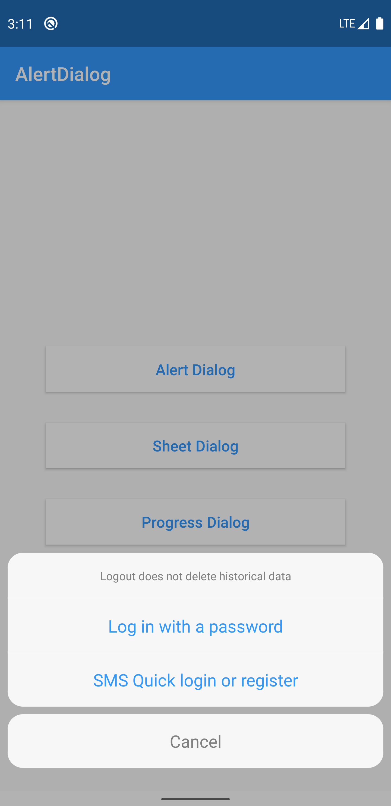
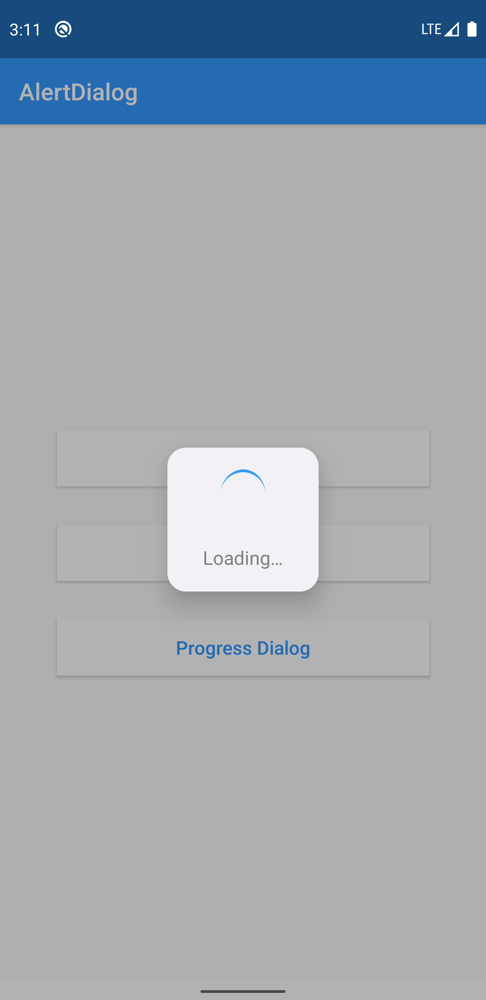

# AlertDialog - Android
Kotlin's AlertDialog and BottomSheetDialog

## Preview

| Photo Click | Photo Drag  | Known issue  |
| ------------- | ------------- | ------------- |
|   |   |   |


## Features

- Imitate IOS style
- Rounded style
- Highly customizable
- Very lightweight

## Known issue
-

## Installation

### Requirements

- Android SDK Version 21
- Kotlin Development language

## Usage

```kotlin

val alertDialog = AlertDialog(this)
alertDialog.setTitle(R.string.mobile_phone_password_wrong)            
alertDialog.show()

val items = arrayOf(getString(R.string.password_login), getString(R.string.sms_login_or_register))
val sheetDialog = SheetDialog(this, items)
sheetDialog.setMessage(R.string.logout_prompt)
sheetDialog.show()
sheetDialog.onItemClickListener = {

}

val progressDialog = ProgressDialog(this)
progressDialog.show()

```

## Author
<a src="https://github.com/weifans">
    
</a>


Does your organization or project use PhotoBrowse? Please let me know by email.

- weifans, duanhaisi@gmail.com
- FlyWind https://feifeng.cn

## License

AlerDialog is available under the MIT license. See the LICENSE file for more info.
